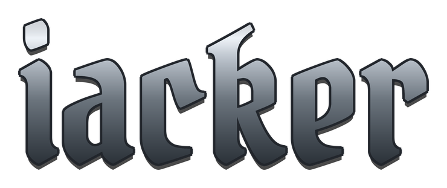

<!--
  README profil GitHub : iacker (Erwan Billard)
  Thème : fer forgé / médiéval — acier #B0B8C1 sur fond #0D1117
  Libs : capsule-render · skillicons.dev · shields.io · Pirata One / Cinzel (wordmark forgé)
-->

 

**Cloud & Platform Engineer — DevSecOps**

  

 

## Ce que je fais

Je construis et opère l'infrastructure qui fait tourner des charges GPU et LLM en production, sur du **cloud hybride** — sur site plus AWS/Azure. J'automatise le provisioning, je sécurise la chaîne, et je garde le coût sous contrôle.

- **`Cloud hybride`** : AWS, Azure, sur site, GPU bare metal et cloud
- **`Kubernetes / Platform`** : k3s, Talos, Helm, GitOps (Flux, Argo), autoscaling
- **`IaC`** : Terraform, Ansible, pipelines reproductibles, teardown propre
- **`DevSecOps`** : eBPF/NDR, hardening, supply chain, zéro trust
- **`GPU / LLM serving`** : vLLM, quantization FP16/FP8, DCGM, coût €/token mesuré

 

## Projets

| Projet | En bref |
|--------|---------|
| **[gpu-inference-reliability-lab](https://github.com/iacker/gpu-inference-reliability-lab)** | Lab SRE : vLLM sur k3s, observabilité DCGM, coût €/token et énergie **mesurés**, runbooks d'incidents. |
| **[Talos_Bastion_DevSecOps](https://github.com/iacker/Talos_Bastion_DevSecOps)** | Cluster Talos Linux GitOps : Cilium (eBPF), Traefik, ArgoCD, accès zéro trust. |
| **[Azure-Pipeline-Custom-Image](https://github.com/iacker/Azure-Pipeline-Custom-Image)** | CI/CD Azure DevOps : image VM custom déployée via Managed DevOps Pool. |
| **[terraform-runpod-vllm](https://github.com/iacker/terraform-runpod-vllm)** | Un `terraform apply`, et un GPU RunPod sert un LLM en API OpenAI. Budget guard, teardown propre. |
| **[mcp-scalpel](https://github.com/iacker/mcp-scalpel)** | Proxy de filtrage sémantique pour le Docker MCP Gateway. Réduit les tokens de catalogue par tour. |
| **[Harness-Cluster](https://github.com/iacker/Harness-Cluster)** | Lab k3s 2 nœuds piloté en GitOps par Flux CD, sur hardware recyclé. |

 

`chaque commit est une cible` : mon graphe de contribution joué en space shooter, régénéré chaque jour

 

## Contact

