<!--
  ╔══════════════════════════════════════════════════════════════╗
  ║  README profil GitHub — iacker                               ║
  ║  Style: NVIDIA (vert #76B900 sur fond noir #0D1117)          ║
  ║  Repo cible: iacker/iacker  →  README.md à la racine          ║
  ║  Libs: capsule-render · readme-typing-svg · skillicons.dev    ║
  ║        github-readme-stats · shields.io · snake (Action)      ║
  ╚══════════════════════════════════════════════════════════════╝
-->

<!-- ░░░ LOGO CALLIGRAPHIÉ CUSTOM (néon vert graffiti sur noir) ░░░ -->
<div align="center">


<sub>**AI Architect** · **HPC** · **Agentic Orchestration**</sub>

<!-- ░░░ TYPEWRITER ANIMÉ (Orbitron, vert NVIDIA) ░░░ -->
[](https://git.io/typing-svg)

<!-- Compteur de vues + followers (badges verts) -->


</div>

---

## `0x00 >` 

```yaml
identity:
  role:      Architecte IA — systèmes agentiques & infra HPC/GPU
  origin:    DevSecOps senior (Cloud · K8s · Terraform · CI/CD)
  focus:     orchestration multi-agents en production
  conviction: "On ne prompte pas un agent — on conçoit le système qui le prompte."
  paradigm:  loop-engineering
```

---

## `0x01 >` 

<div align="center">

[](https://skillicons.dev)
[](https://skillicons.dev)

</div>

- **`AI / Agentic`** — orchestration multi-agents, Hermes, MCP, RAG, fine-tuning, vLLM
- **`HPC / GPU`** — clusters GPU, LLM serving, quantization, scheduling, RunPod / bare-metal
- **`Cloud & K8s`** — Talos, Helm, GitOps, autoscaling, multi-cluster hybride
- **`Security`** — DevSecOps, Vault, eBPF NDR, supply chain, hardening

---

## `0x02 >` 

<div align="center">

[](https://github.com/iacker/Excalibur)
[](https://github.com/iacker/AzureClaw)
[](https://github.com/iacker/agentic-os)
[](https://github.com/iacker/Talos_Bastion_DevSecOps)
[](https://github.com/iacker/Mando)
[](https://github.com/iacker/Nimbridge)

</div>

---

## `0x03 >` 

<div align="center">

<!-- Carte metrics générée par lowlighter/metrics → SVG committé, 100% fiable -->


<br/>

<!-- Streak (service demolab, fiable) -->


</div>

---

<!-- ░░░ SNAKE ANIMÉ (généré par GitHub Action Platane/snk) ░░░ -->
<div align="center">


</div>

---

## `0x03.5 >` 

<!-- ░░░ CALENDRIER 3D ISOMÉTRIQUE (SVG committé — tableau de contributions plein) ░░░ -->
<div align="center">



</div>

---

## `0x04 >` 

<div align="center">

[](https://linkedin.com/in/erwan-billard)
[](mailto:erwan.billard@protonmail.com)
[](https://github.com/iacker)

</div>

<div align="center">

</div>
