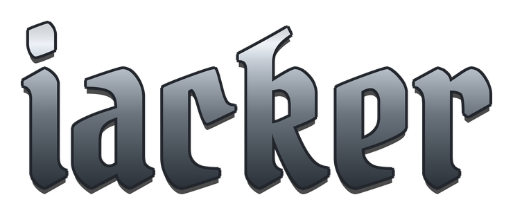

<!--
  GitHub profile README: iacker (Erwan Billard)
  Theme: wrought iron / medieval — steel #B0B8C1 on #0D1117
  Libs: capsule-render · skillicons.dev · shields.io · Pirata One / Cinzel (forged wordmark)
-->

 

**Cloud & Platform Engineer, DevSecOps**

  

[Kepler](https://github.com/sustainable-computing-io/kepler) maintainer (CNCF) · measuring energy consumption in Kubernetes

 

 

## What I do

I build and operate the infrastructure that serves GPU and LLM workloads in production, on hybrid cloud (on-prem plus AWS/Azure). I automate provisioning, secure the chain, and keep cost under control.

- **`Hybrid cloud`** : AWS, Azure, on-prem, GPU bare metal and cloud
- **`Kubernetes / Platform`** : k3s, Talos, Helm, GitOps (Flux, Argo), autoscaling
- **`IaC`** : Terraform, Ansible, reproducible pipelines, clean teardown
- **`DevSecOps`** : eBPF/NDR, hardening, supply chain, zero trust
- **`GPU / LLM serving`** : vLLM, FP16/FP8 quantization, DCGM, measured €/token cost

 

## Projects

| Project | In short |
|--------|---------|
| **[gpu-inference-reliability-lab](https://github.com/iacker/gpu-inference-reliability-lab)** | SRE lab: vLLM on k3s, DCGM observability, **measured** €/token and energy, incident runbooks. |
| **[Talos_Bastion_DevSecOps](https://github.com/iacker/Talos_Bastion_DevSecOps)** | Talos Linux GitOps cluster: Cilium (eBPF), Traefik, ArgoCD, zero-trust access. |
| **[terraform-runpod-vllm](https://github.com/iacker/terraform-runpod-vllm)** | One `terraform apply`, a RunPod GPU serves an LLM over the OpenAI API. Budget guard, clean teardown. |
| **[mcp-scalpel](https://github.com/iacker/mcp-scalpel)** | Semantic filtering proxy for the Docker MCP Gateway. Cuts catalog tokens per turn. |
| **[Azure-Pipeline-Custom-Image](https://github.com/iacker/Azure-Pipeline-Custom-Image)** | Azure DevOps CI/CD: custom VM image deployed via Managed DevOps Pool. |

 

## Contact

